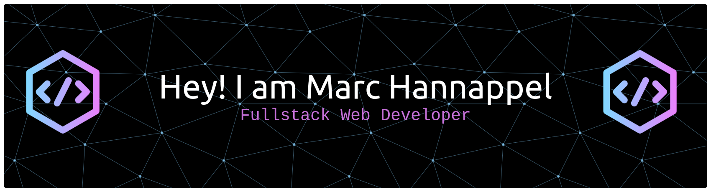

<h3 align="center">🕸️ Web Developer | Laravel Specialist</h3>

  

---

### 🚀 About Me

I’m a passionate **Web Developer** focused on **Laravel and modern web technologies**.  
I love turning complex problems into **clean, scalable, and maintainable solutions**.

- 🏗️ Full-stack & PWA development
- 🔗 Clean code & clean architecture enthusiast
- 🌱 Always improving, always learning Laravel
- ⚡ Fun fact: *Artisan knows me better than my shell history*

### 🧑‍💻 What I Can Help You With

- ⚙️ Custom **Laravel-based web applications** tailored to your needs
- 🔗 Design & implementation of **Laravel Applications**, **PWA's** and robust backend architectures
- 🔐 Secure **authentication, authorization & user management**
- 🏗️ Refactoring, optimizing & modernizing existing Laravel projects
- 🚀 Performance optimization with a strong focus on **clean code**
- 🧪 Automated testing & long-term maintainability

### 🛠️ How I Work

- ✅ Clean, readable & well-structured code following industry standards
- 🧠 Strong focus on **best practices, security & maintainability**
- 🔄 Clear communication with transparent progress updates
- 📦 Scalable solutions designed to grow with your product
- 📚 Codebases that are easy to understand, extend & hand over

----

### 🛠️ Tech Stack

#### 👨‍💻 Backend

#### 🎨 Frontend

##### Frameworks & Libraries

#### 🗄️ Databases

#### ☁️ Cloud & DevOps

##### OS

##### Cloud

##### DevOps

#### 🤖 AI & Automation

#### 🔧 Tools & Workflow

##### Dev Tools

##### IDE

##### Office

##### Design

##### Browser

---

### 🧩 Laravel Ecosystem

- ⚙️ **Eloquent ORM** & database modeling
- 🔐 **Authentication & Authorization**
- 📦 **Laravel Packages** & package integration
- 📨 **Queues, Jobs & background processing**
- 🧪 **Testing** with Pest
- ⚡ **Livewire & Blade** for dynamic UIs

**Laravel Tooling & Services**
- 💳 **Cashier (Stripe)** — coming soon
- 📊 **Horizon** (Redis-powered queue monitoring)
- 🚩 **Pennant** (feature flags)
- 🧹 **Pint** (code style & formatting)
- 🐳 **Sail** (local development environment)
- 🔍 **Scout** (full-text search)
- 🧪 **Telescope** (debugging & insights)
- 🚀 **Forge** (server provisioning & deployment)

---

### 🚀 Featured Projects

- 🔥 **Laravel SaaS App**  
  Multi-tenant application with authentication, roles & billing.

---

### 📊 GitHub Stats

  
  

  

---

### 🌐 Connect With Me

---

### Sponsor me

⭐️ *Crafting elegant web solutions with Laravel.*
